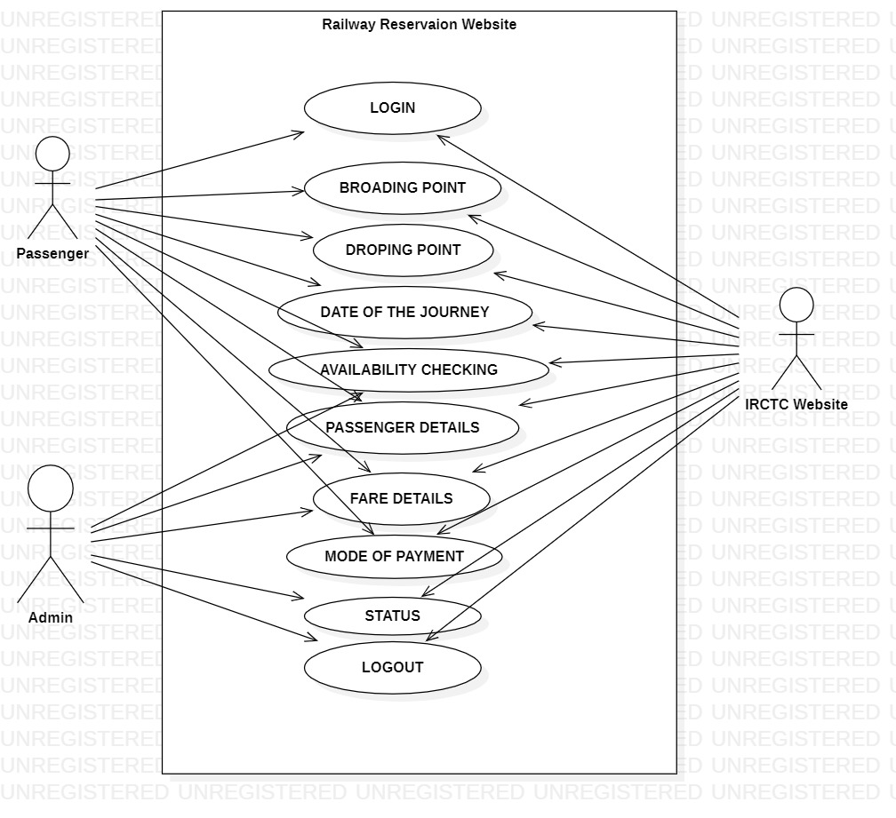
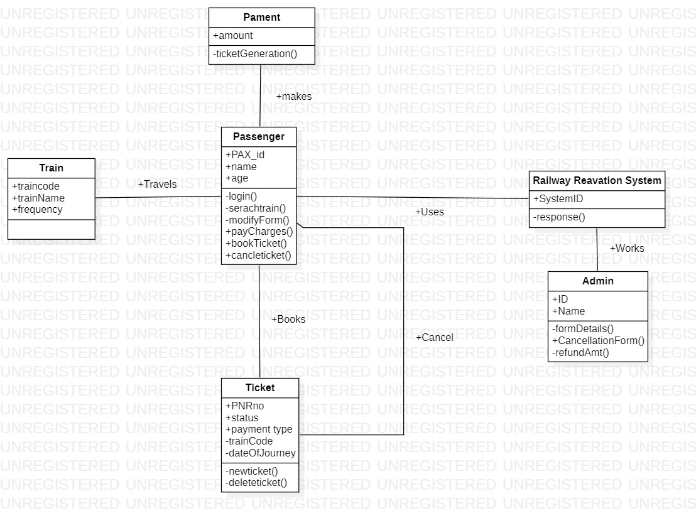
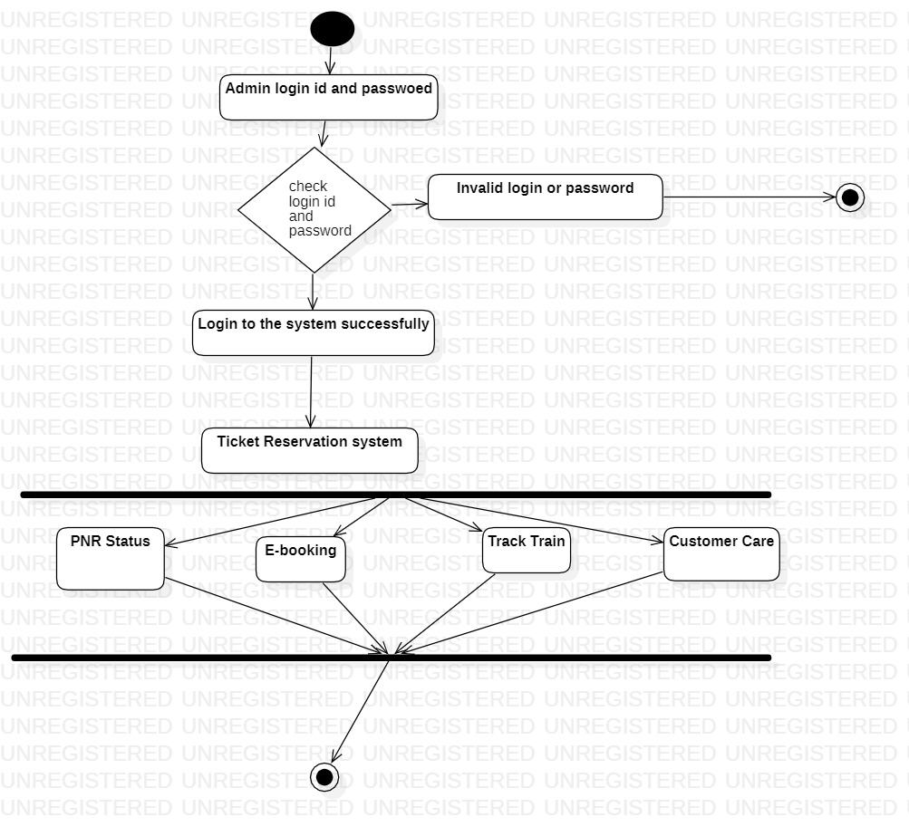
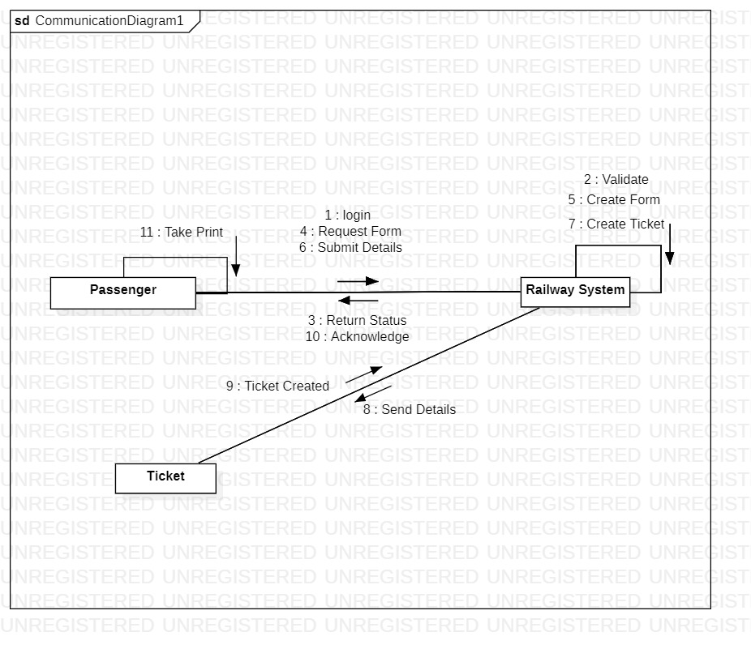
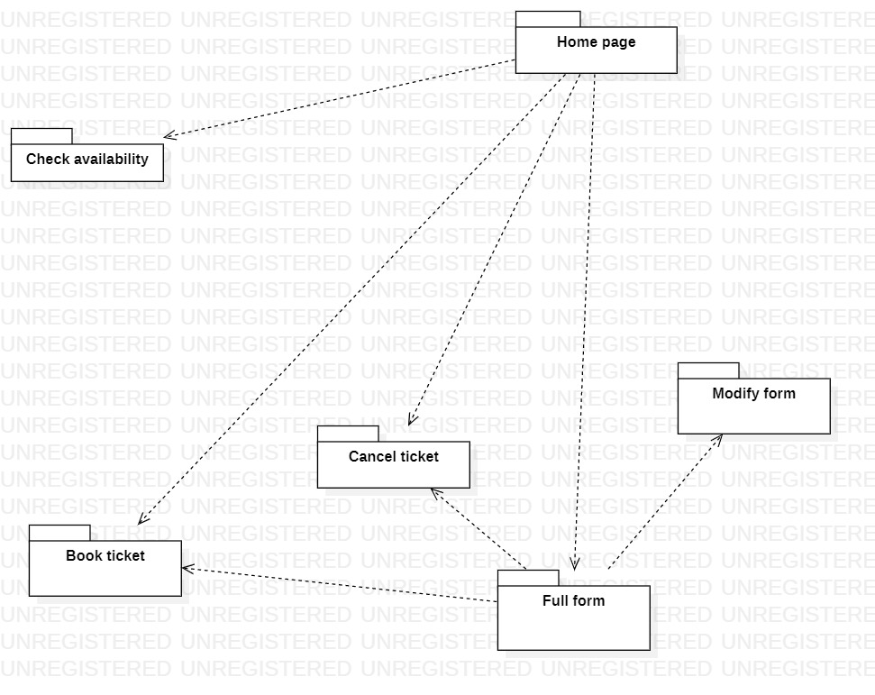
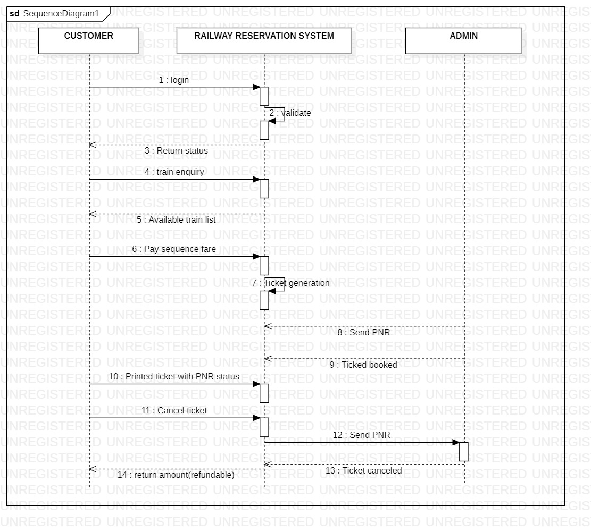

# Exp - 3 RAILWAY MANAGEMENT SYSTEM

# AIM:
To draw the UML diagram for Railway Management System.
# SRS (Procedure):
Create the following diagrams in StarUML:

◉ Use Case Diagram

◉ Class Diagram

◉ Activity Diagram

◉ Package Diagram

◉ Communication Diagram

◉ Sequence Diagram
# DIAGRAMS:
USECASE DIAGRAM

CLASS DIAGRAM

ACTIVITY DIAGRAM

COMMUNICATION DIAGRAM

PACKAGE DIAGRAM

SEQUENCE DIAGRAM

# RESULT:
Thus, the UML Diagrams for a Railway Management System has been drawn and verified.